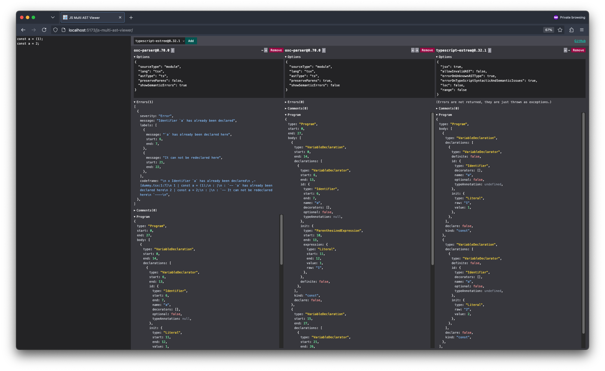

# js-multi-ast-viewer

A viewer that allows you to compare JS ASTs output by multiple parsers side-by-side!



Currently supports:

- `oxc-parser`
- `acorn` + `acorn-jsx`
- `meriyah`
- `@typescript-eslint/typescript-estree`
  - Supports type-check `errorOnTypeScriptSyntacticAndSemanticIssues` option 💪

## Development

```sh
pnpm i
pnpm dev
```
